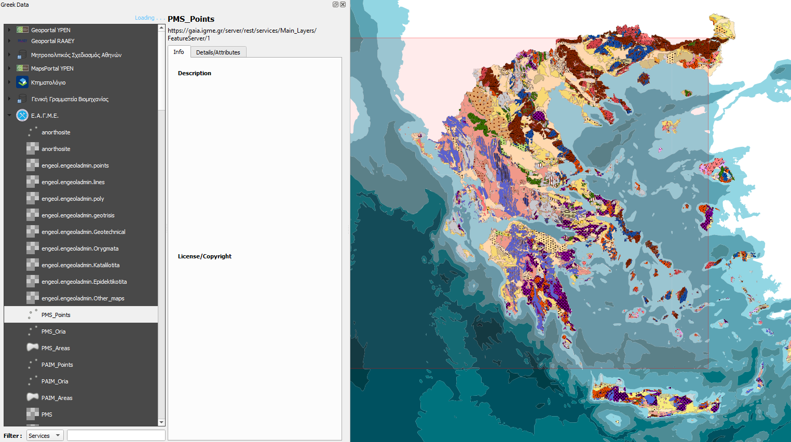

# Greek-Data---QGIS-Plugin

Greek Data is a QGIS plugin that enables easy acces to open geospatial data nodes of official Greek agencies &amp; institutions. It allows viewing of available datasets and their attribute fields and direct addition to the map via WFS

